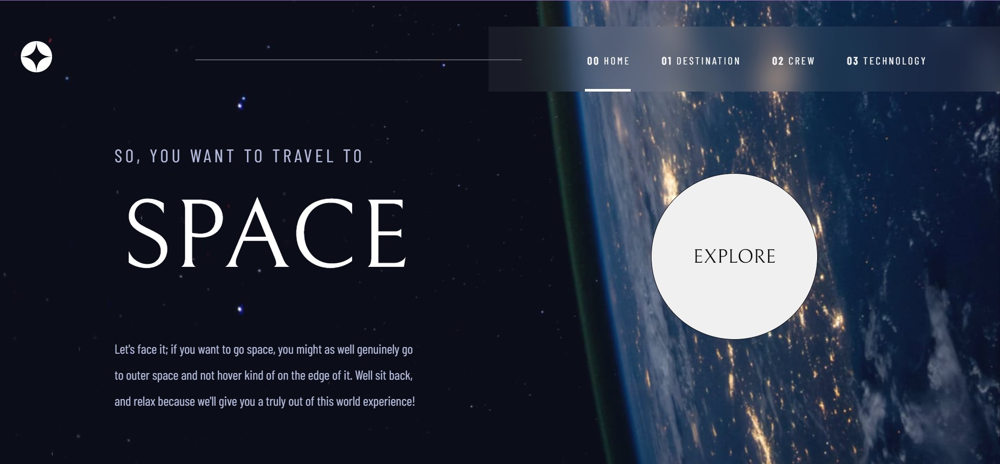

# Frontend Mentor - Space tourism website solution

This is a solution to the [Space tourism website challenge on Frontend Mentor](https://www.frontendmentor.io/challenges/space-tourism-multipage-website-gRWj1URZ3). Frontend Mentor challenges help you improve your coding skills by building realistic projects.

## Table of contents

- [Overview](#overview)
  - [The challenge](#the-challenge)
  - [Screenshot](#screenshot)
  - [Links](#links)
- [My process](#my-process)
  - [Built with](#built-with)
  - [What I learned](#what-i-learned)
  - [Continued development](#continued-development)
  - [Useful resources](#useful-resources)
- [Author](#author)
- [Acknowledgments](#acknowledgments)

**Note: Delete this note and update the table of contents based on what sections you keep.**

## Overview

### The challenge

Users should be able to:

- View the optimal layout for each of the website's pages depending on their device's screen size
- See hover states for all interactive elements on the page
- View each page and be able to toggle between the tabs to see new information

### Screenshot



### Links

- Solution URL: [Add solution URL here](https://github.com/Wizzaisha/space-page)
- Live Site URL: [Add live site URL here](https://space-page-hdo3uqy54-wizzaisha.vercel.app/)

## My process

### Built with

- Flexbox
- [React](https://reactjs.org/) - JS library

### What I learned

1. I learned a lot of interesting things, one was setting dynamic backgrounds in the app, depending the route; for that I established variables in the index.css for the differents sizes (desktop, tablet and mobile) and did a function that takes the images required and using js I changed the variables depending of the route, as you can see in the code:

```css
body {
  --desktop: url("../public/assets/home/background-home-desktop.jpg");
  --tablet: url("../public/assets/home/background-home-mobile.jpg");
  --mobile: url("../public/assets/home/background-home-tablet.jpg");
}
```

```js
function setBackground(desktop, tablet, mobile) {
  document.body.style.setProperty("--desktop", `url(${desktop})`);
  document.body.style.setProperty("--tablet", `url(${tablet})`);
  document.body.style.setProperty("--mobile", `url(${mobile})`);
}

if (location.pathname === "/") {
  setBackground(
    imagesApp.home.desktop,
    imagesApp.home.tablet,
    imagesApp.home.mobile
  );
} else if (location.pathname === "/destination") {
  setBackground(
    imagesApp.destination.desktop,
    imagesApp.destination.tablet,
    imagesApp.destination.mobile
  );
} else if (location.pathname === "/crew") {
  setBackground(
    imagesApp.crew.desktop,
    imagesApp.crew.tablet,
    imagesApp.crew.mobile
  );
} else if (location.pathname === "/technology") {
  setBackground(
    imagesApp.technology.desktop,
    imagesApp.technology.tablet,
    imagesApp.technology.mobile
  );
}
```

2. Another interesting thing that I learned, was doing a component for all the navbars that I needed in the challenge, where I just did a component with the basic settings, styles and functionalities needed and then calling it in the componentes where I require it, for example the destination, crew and technology page, whose have differents types of navigation bars.

```js
<SlideBar
  arrData={arrData}
  handleNavBar={getDestiny}
  currentData={destiny.toUpperCase()}
  hoverType="line"
  styleBar={styleDestBar}
/>
```

```js
export default function SlideBar({
  arrData,
  handleNavBar,
  currentData,
  hoverType,
  styleBar,
}) {
  return (
    <ul style={styleBar.bar} className="navBarStyles">
      {arrData &&
        arrData.map((element, index) => {
          return (
            <div key={element + index}>
              <li
                className={`navText ${
                  hoverType === "line"
                    ? "hoverLine"
                    : hoverType === "point"
                    ? "hoverPoint pointStyle"
                    : hoverType === "number"
                    ? "hoverNumber numberStyle"
                    : ""
                }`}
                style={currentData === element ? styleBar.link : null}
                onClick={() => handleNavBar(element)}
              >
                {hoverType === "point" ? <span>&#9679;</span> : element}
              </li>
            </div>
          );
        })}
    </ul>
  );
}
```

### Continued development

Now I want to be more organized and clear with my code, there are a lot of things that I need to be aware of, such as moduralize functionalities, do a better job cleaning the code and improve my skills for css styles. Also, I want to try to do future proyects in tyscript, include redux and use a backend or api.

### Useful resources

- [W3Schools](https://www.w3schools.com/) - This helped me for find useful information about js, css and html.

## Author

- Website - [Ever Ramirez](https://portafolio-ever.vercel.app/)
- Frontend Mentor - [@Wizzaisha](https://www.frontendmentor.io/profile/Wizzaisha)
- Twitter - [@Wizz2\_](https://twitter.com/Wizz2_)
